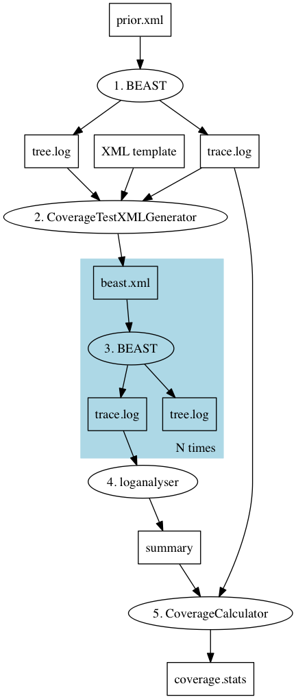
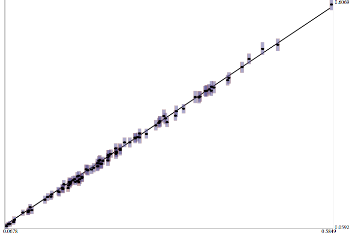
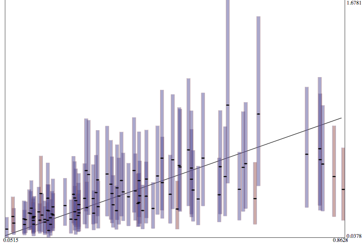
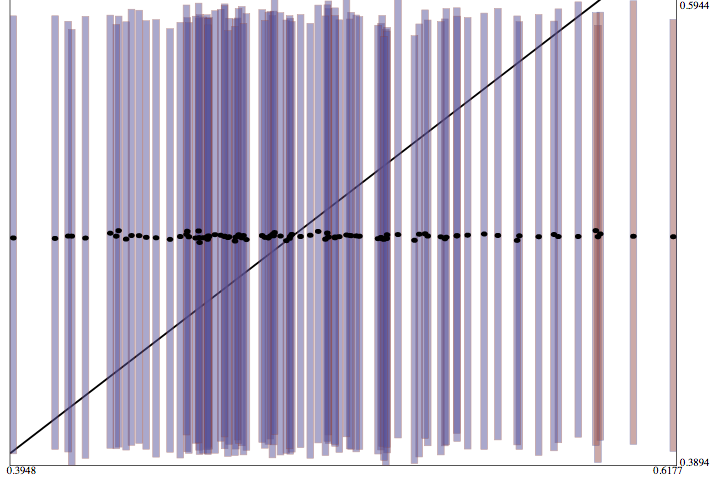
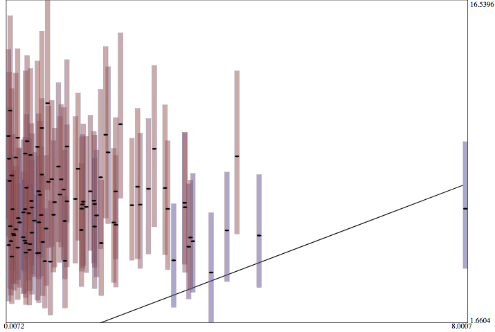
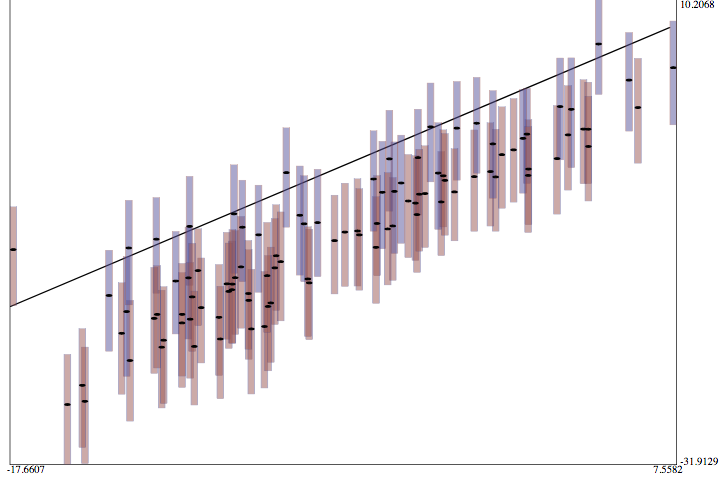
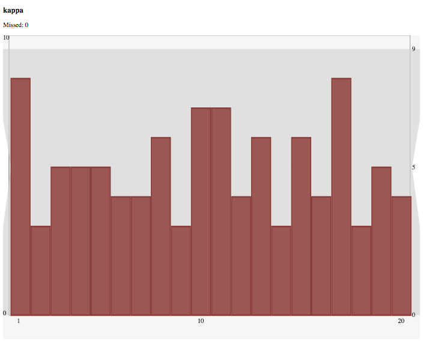
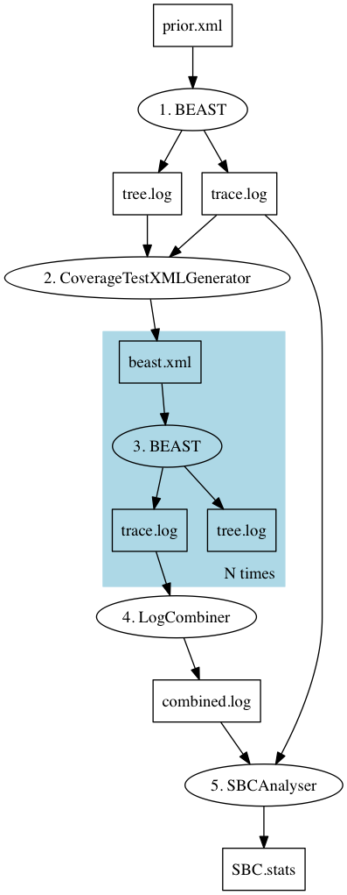

<head>
<link rel="stylesheet" id="dashicons-css" href="http://www.beast2.org/css/dashicons.css" type="text/css" media="all">
<link rel="stylesheet" id="admin-bar-css" href="http://www.beast2.org/css/admin-bar.css" type="text/css" media="all">
<link rel="stylesheet" id="lean-captcha-css-css" href="http://www.beast2.org/css/lean-captcha.css" type="text/css" media="all">
<link rel="stylesheet" id="twentyfourteen-lato-css" href="http://www.beast2.org/css/css.css" type="text/css" media="all">
<link rel="stylesheet" id="genericons-css" href="http://www.beast2.org/css/genericons.css" type="text/css" media="all">
<link rel="stylesheet" id="twentyfourteen-style-css" href="http://www.beast2.org/css/style.css" type="text/css" media="all">

<style id="simpler-css-style" type="text/css">
body { 
    background-color: inherit; 
    }
	html { margin-top: 32px !important; margin-left:5cm; margin-right:5cm;max-width: 70%;}
</style>
</head>
<body>

# Some guidance for developing new methods in BEAST 2

Disclaimer: below some ramblings on methods development for BEAST 2 [@beast, @beastbook, @bouckaert2019beast] packages. This is a living document based on collected wisdom of BEAST developers, which keeps evolving.

This document is about testing validity of a BEAST method, not the programming aspects (like setting up dependencies, wrapping up files into a package, etc.), which can be found in the [tutorial for writing a BEAST 2 package](http://www.beast2.org/writing-a-beast-2-package) and [writing a package for a tree prior tutorial](https://github.com/BEAST2-Dev/beast-docs/blob/master/CreateNewTreePrior/CreateNewTreePrior.md).


There are several levels of validation:

* the model appears to produce reasonable results on a data set of interest.
* the model produces more reasonable results on a data set of interest than other models.
* unit tests show correctness of direct simulator implementation, likelihood implementation and/or  operator implementation(s).
* sampling from prior conforms to expectations.
* a simulation study shows parameters simulated under the model can be recovered by inference from simulated data for a fixed tree and fixed other parameters for a small number of illustrative cases.
* as previous but with sampled tree and sampled parameters, so the process is repeated $N$ times and tree and parameters sampled from a reasonable prior.
* a simulation study shows the model can recover parameters (most of the time) even when there are model violations in simulating the parameters.


Automate the experiment -- you *will* do it again, in about 6 months time, when you least expect it.

Document the experiment -- "It is like cleaning toilets: nobody want to do it, but it is more pleasant for visitors. You will probably be one of those visitors in 6 months time..."

http://videolectures.net/cancerbioinformatics2010_baggerly_irrh/

Reproducibility with docker:  
Steps to run the attached BEAST 2 analysis:
1. Install Docker (www.docker.com)
2. From a terminal window, run the following from the directory containing the XML file:
```  docker run -v$PWD:/data tgvaughan/beast2_bacter beast ecoli.xml ```
That's it! (Under Windows the $PWD would have to be replaced with the path of the current directory.)  These instructions are impervious to most things we worry about: core and package API changes, Java version changes and OS dependencies.


## Testing new methods

New methods require usually require two parts: an implementation $I(M)$ of a model $M$ and associated probability $p_I(\theta|M)$ of states $\theta$, and MCMC operators $R(\theta)\to\theta'$ for creating proposals $\theta'$ for moving through state space starting in state $\theta$ (though sometimes just an operator is validated that is much more efficient than previously existing operators). This guide contains some procedures to get some confidence that the model and operators are correctly implemented. Ideally, we have an independent implementation of a simulator $S(M)\to\theta$ that allows (possibly inefficiently) to sample from the target distribution $p_S(\theta|M)$. If so, we also need to verify that the simulator is correctly implemented. In summary, we need to establish correctness of:

* the simulator implementation $S(M)\to\theta$ (if any)
* the model implementation $I(M)$ 
* operator implementations $R$


# Verify correctness of simulator implementation

To verify correctness of a simulator implementation $S$ for model $M$ directly, the distributions $p_S(\theta|M)$ should match expected distribution based on theory. We can verify this by drawing a large number of samples using $S$, calculate summary statistics on the sample and compare these with analytical estimates for these statistics. For example, for tree priors, expected tree heights can often be determined, and for parametric distributions we often know mean and variance values. Simulating values and making sure the expected value is in the expected range is easy to verify in Tracer: the expected values should be within the mean value logged plus/minus 2 times stderr of mean (as shown in the summary statistics panel).

When no analytical estimates of statistics are available, it may be possible to find a simplified case for which an analytical solution exists, for example when the tree only has two taxa.

Examples of simulators (this list is far from exhaustive):

* the [MASTER](http://tgvaughan.github.io/MASTER/) [@vaughan2013stochastic] BEAST 2 package is a general purpose package for simulating stochastic population dynamics models which can be expressed in terms of a chemical master equation.
* SimSnap for SNAPP [@bryant2012inferring] is a custom build implementation in C++ for simulating alignments for a fixed tree and SNAPP parameters.
* The `beast.app.seqgen.SequenceSimulator` class in BEAST 2 can be used to simulate alignments for general site models using reversible substitution models. See [testSeqGen.xml](https://github.com/CompEvol/beast2/blob/master/examples/testSeqGen.xml) for an example.
* Models implemented in other phylogenetic software packages, such a BEAS 1, MrBayes, RevBayes, allow sampling a distribution using MCMC.
* The `beast.core.DirectSimulator` class in BEAST 2 can be used to draw samples from distributions in BEAST that extend `beast.core.distribution.Distribution` and implement the `sample(state, random)` method. You can set up an XML file and run it in BEAST. Here are a few examples: [testDirectSimulator.xml](https://github.com/CompEvol/beast2/blob/master/examples/testDirectSimulator.xml),
[testDirectSimulator2.xml](https://github.com/CompEvol/beast2/blob/master/examples/testDirectSimulator2.xml), and
[testDirectSimulatorHierarchical.xml](https://github.com/CompEvol/beast2/blob/master/examples/testDirectSimulatorHierarchical.xml).


# Verify correctness of model implementation

For small examples for which an analytical result can be calculated a unit test can be written to confirm the implementation behaves correctly for the expected result. For example, for a small tree ((A:1.0,B:1.0):1.0,(C:1.0,D:1.0):1.0) with birth rate 1 we can calculate the expected value of the Yule prior ($\log(P)=-6$), and write a unit test to make sure it matches:

```
package test;

import org.junit.Test;

import beast.evolution.speciation.YuleModel;
import beast.util.TreeParser;
import junit.framework.TestCase;

public class YuleLikelihoodTest extends TestCase {

	@Test
	public void testYuleLikelihood() {
        TreeParser tree = new TreeParser("((A:1.0,B:1.0):1.0,(C:1.0,D:1.0):1.0);");
        
        YuleModel likelihood = new YuleModel();
        likelihood.initByName("tree", tree, "birthDiffRate", "1.0");

        assertEquals(-6.0, likelihood.calculateLogP());
    }

}
```

In theory, the inferred distributions $p_I(\theta|M)$ should match the simulator distribution $p_S(\theta|M)$. However, drawing samples from $p_I(\theta|M)$ typically requires running an MCMC chain, which requires MCMC proposals $R$ to randomly walk through state space. If we do this, we need to rely on $R$ being correctly implemented. So, if we find that $p_I(\theta|M)$ and $p_S(\theta|M)$ do not match, it is not possible to tell whether problem is with an operator $R$ or with the model implementation $I(M)$.

The Hastings ratio for this operator is $P(\theta)/P(\theta')$. Consequently, every proposal is accepted, whether $p_I(\theta|M)$ is correctly implemented or not.

In BEAST, if the `sample` method is implemented in a class derived from `Distribution`, you can use  `beast.experimenter.DirectSimulatorOperator` in the Experimenter package to set up an MCMC analysis in XML. Here is an example that draws a birth rate from an exponential distribution with mean 1, and a Yule distribution to generate a tree. Note that the tree heigh statistic is logged, as well as an expression for a clock rate (being 0.5/tree-height) for evaluation purposes. The MCMC sample can be compared with the direct sample using the example file [testDirectSimulator.xml](https://github.com/rbouckaert/Experimenter/blob/master/examples/testDirectSimulator.xml).


```
<beast version="2.0" namespace="beast.core
:beast.evolution.alignment
:beast.evolution.tree
:beast.math.distributions
:beast.evolution.speciation
:beast.core.util
:beast.core.parameter">


    <run spec="MCMC" chainLength="1000000">
    	<state id="state">
    		<stateNode idref="tree"/>
    		<stateNode idref="birthDiffRateParam"/>
    	</state>

        <distribution spec="CompoundDistribution" id="fullModel">
            <distribution spec="YuleModel" id="yuleModel">
                <tree spec="Tree" id="tree">
                    <taxonset spec="TaxonSet">
                        <taxon spec="Taxon" id="t1"/>
                        <taxon spec="Taxon" id="t2"/>
                        <taxon spec="Taxon" id="t3"/>
                        <taxon spec="Taxon" id="t4"/>
                        <taxon spec="Taxon" id="t5"/>
                    </taxonset>
                </tree>
                <birthDiffRate spec="RealParameter" id="birthDiffRateParam" value="1.0"/>
            </distribution>

            <distribution spec="beast.math.distributions.Prior" id="birthDiffRatePrior">
                <distr spec="Exponential" id="xExpParamDist" mean="1"/>
                <x idref="birthDiffRateParam"/>
            </distribution>

        </distribution>

		<operator spec="beast.experimenter.DirectSimulatorOperator" weight="1" state="@state">
			<simulator id="DirectSimulator" spec="beast.core.DirectSimulator" nSamples="1">
				<distribution idref="fullModel"/>
			</simulator>
		</operator>

        <logger id="tracelog" logEvery="1000" fileName="$(filebase).log">
            <log idref="birthDiffRateParam"/>
            <log id="clockRate" spec="beast.util.Script" expression="0.5/TreeHeight">
            	<x id="TreeHeight" spec="beast.evolution.tree.TreeHeightLogger" tree="@tree"/>
            </log>
            <log idref="TreeHeight"/>
        </logger>

        <logger id="treelog" logEvery="1000" fileName="$(filebase).trees">
            <log idref="tree"/>
        </logger>

        <logger id="screenlog" logEvery="1000">
            <log idref="birthDiffRateParam"/>
        </logger>
    </run>
</beast>
```

Make sure when sampling from the prior through MCMC that the chain length is sufficiently large and log frequency large enough to ensure that each sample is independent of the previous sample. The ESSs shown in Tracer should be close to N when there are N samples in the trace log, for most of the items in the log. There may be a few items with an ESS that is a bit lower, and inspection of the trace plot should tell you whether lower log frequencies should be used.

Comparing two distributions can be done by

* eye balling the marginal likelihoods in Tracer and making sure they are close enough.
* testing whether parameters are covered 95% of the time in the 95% HPD interval of parameter distributions.
* using a statistical test, e.g. the Kolmogorov-Smirnov test, to verify the distributions $p_I(\theta|M)$ and $p_S(\theta|M)$ are the same.


`TraceKSStats` calculate Kolmogorov-Smirnof statistic for comparing trace logs. TraceKSStats has the following inputs:

* trace1 (LogFile): first trace file to compare (required)
* trace2 (LogFile): second trace file to compare (required)
* burnin (Integer): percentage of trace logs to used as burn-in (and will be ignored) (optional, default: 10)

Sample output: 

```
Trace entry                                      p-value
posterior                                        1.0
likelihood                                       0.21107622404022763
prior                                            0.036794035181748064
treeLikelihood                                   0.04781117967724258
TreeHeight                                       0.036794035181748064
YuleModel                                        0.005399806065857771
birthRate                                        0.2815361702146215
kappa                                            0.62072545444263
freqParameter.1                                  0.0
freqParameter.2                                  8.930072172019798E-5
freqParameter.3                                  1.0883734952171764E-6
freqParameter.4                                  0.0
```

Though some values have very low p-values, meaning they differ significantly, it is recommended to verify this using Tracer to make sure that the test is not unduly influenced by outliers.


## Score based model validation

For a density $p$ on data $x$ (this could be a scalar, vector, or a tree) parameterised by the vector $\theta$, the expected value of the score function $U(\theta,x)=\frac{\partial}{\partial\theta}\log p(x;\theta)$ is 0:

$$
E(U(\theta,x)) = \int U(\theta,x)p(x;\theta)dx = 0
$$ {#eq:scorefunction}

(this is the expected value over the data $x$ at the true parameters $\theta$.) Also, the covariance of the score function is equal to the negative Hessian of the log-likelihood:

$$
E\left(U(\theta, x)U(\theta, x)^T + {\partial^2}/{\partial\theta^2}\ \log p(x;\theta)\right)  = 0
$$ {#eq:variancestatistic}


These properties can be used in conjunction with a direct simulator as a necessary but not sufficient check that the likelihood is implemented correctly. The score function (+@eq:scorefunction) and Hessian (+@eq:variancestatistic) statistics can be calculated on samples from the simulator and a hypothesis test used to check that their mean is 0. In the multivariate case a potentially useful test is the likelihood ratio test for a multivariate normal with zero mean ([implemented here](https://github.com/christiaanjs/beast-validation/blob/master/src/beast/validation/tests/MultivariateNormalZeroMeanTest.java)). If there are non-identifiable parameters there may be issues with performing this test as colinearity will lead to a singular sample covariance matrix.

In practice it is appropriate to compute the score function by calculating derivatives using finite differences ([implemented here](https://github.com/christiaanjs/beast-validation/blob/master/src/beast/validation/statistics/NumericalScoreFunctionStatistics.java)).

### Writing a test

The BEAST validation package is designed around three core object types: it performs a *test* on *statistics* drawn from *samplers*.
BEAST validation tests are implemented within the BEAST 2 XML parser framework. The main Runnable class is [`beast.validation.StochasticValidationTest`](https://github.com/christiaanjs/beast-validation/blob/master/src/beast/validation/StochasticValidationTest.java). `StochasticValidationTest` has inputs for each of the core object types: `samplers`, `statistics` and a `test`. Note that some tests may be designed for one, two or many sampler/statistic pairs.

`StochasticValidationTest` has some additional parameters:

* `alpha`: The significant level to use in the test
* `nSamples`: The number of samples to draw from each sampler
* `printEvery`: How often to report sampling progress
* `sampleLoggers`: Loggers to run for every sample (usually the statistics)
* `resultLoggers`: Loggers to run after testing

There are currently two useful combinations of samplers, statistics and test implemented by BEAST validation.

### Score function validation

This test validates a combination of likelihood and direct simulator using a known property of probability density functions: that the expectation of the gradient of the log-likelihood at the true parameter values is zero (see [`stats-tricks.md`](stats-tricks.md)). The core components of this test are (with a single sampler-statistic pair):

* a simulator: This could be a custom simulator, or make use of one of the generic simulation tools available, such as `beast.simulation.TreeSamplerFromMaster`
* `beast.validation.statistics.NumericalScoreFunctionStatistics`: a statistic that uses a finite differences to calculate the gradient of a likelihood with respect to some parameters 
    - Note that the `RealParameter` objects included in the `parameter` input should be the same provided to the `Distribution` in the `likelihood` input
* `beast.validation.tests.MultivariateNormalZeroMeanTest`: a likelihood ratio test that uses a multivariate normal fit to the gradients to test for zero mean

An important note is that there are some regularity conditions on the parameters you can use in this test. Roughly, they must not affect the support of the data, which excludes the origin time parameter in tree priors. See [`stats-tricks.md`](stats-tricks.md) for further details.

[An example XML for this test on the birth-death-sampling tree prior](https://github.com/christiaanjs/beast-validation/blob/master/examples/birth-death-sampling-score-function-test.xml) can be found in the BEAST validation examples.

### Running a test

Once you have created an XML and installed the BEAST validation package (pending inclusion in the package repository) using the standard BEAST 2 launcher. Once your test has run, it will provide the result on the console:
```
Performing test...
Test PASSED
p value: 0.284784
```


# Verify correctness of operator implementations

Once simulator $S(M)$ and model implementation $I(M)$ are verified to be correct, next step is implementing efficient operators, running MCMCs to verify that parameters drawn from the prior are covered 95% of the time in the 95% HPD interval of parameter distributions.

The direct simulator operator (see `DirectSimulatorOperator` above) can be used as starting operator, and new operators added one by one to verify correctness.

The BEAST 2 [Experimenter](https://github.com/rbouckaert/Experimenter) package can assist (see section "Using the Experimenter package" below).


## MCMC sampling to verify correctness of operator implementations

A useful test for an MCMC sampler for a model (likelihood + operators) is if it can produce the same distribution as direct simulation. For phylogenetic models, this would usually be the tree prior. The core components of this test:

* Two samplers
    - a simulator (see the previous test for details)
    - `beast.core.SamplerFromMCMC`
        - extends the normal BEAST MCMC class
        - needs a model/likelihood and operators
        - To test a single, potentially non-ergodic operator, a separate simulator could be used as a global operator with the `beast.simulation.OperatorFromSampler` class
* A multivariate statistic
    - `beast.validation.statistics.UltrametricTreeStatistics` provides some basic statistics on BEAST time trees 
    - For an example of statistics on more complex tree-like objects, see [`bacter.util.ConversionGraphStatsLogger`](https://github.com/tgvaughan/bacter/blob/master/src/bacter/util/ConversionGraphStatsLogger.java)
* `beast.validation.tests.BootstrapMultivariateDistributionTest`: a test that bootstraps a multivariate generalisation of the Kolmogorov-Smirnov (KS) statistic to compare distributions (see [`stats-tricks.md`] for further details)

[An example XML for this test on the birth-death-sampling tree prior](https://github.com/christiaanjs/beast-validation/blob/master/examples/birth-death-sampling-prior-sampling-test.xml) can be found in the BEAST validation examples.


## Setting up a direct simulation in BEAST

Using the direct simulator can be done as follows

* Set up `DirectSimulator` at top level
* Add model to simulate from
* Add loggers to register output

### Set up `DirectSimulator` at top level

Use the `nSamples` attribute to specify how many samples to draw.

```
<beast version="2.0" namespace="beast.core:beast.evolution.alignment:beast.evolution.tree:beast.math.distributions:beast.evolution.speciation:beast.core.util:beast.core.parameter">

    <run spec="DirectSimulator" nSamples="100">

		<!-- model goes here -->

		<!-- loggers go here -->

    </run>
</beast>
```


### Add model to simulate from

Here, the model consists of a birthDiffRate parameter, drawn from an exponential distribution. This rate is used in a Yule model to draw trees over a set of 5 taxa, called `t1`, `t2`,...,`t4`. This is placed inside the run element above.

```
<distribution spec="CompoundDistribution" id="fullModel">
    <distribution spec="YuleModel" id="yuleModel">
        <tree spec="Tree" id="tree">
            <taxonset spec="TaxonSet">
                <taxon spec="Taxon" id="t1"/>
                <taxon spec="Taxon" id="t2"/>
                <taxon spec="Taxon" id="t3"/>
                <taxon spec="Taxon" id="t4"/>
                <taxon spec="Taxon" id="t5"/>
            </taxonset>
        </tree>
        <birthDiffRate spec="RealParameter" id="birthDiffRateParam" value="1.0"/>
    </distribution>

    <distribution spec="beast.math.distributions.Prior" id="birthDiffRatePrior">
        <distr spec="Exponential" id="xExpParamDist" mean="1"/>
        <x idref="birthDiffRateParam"/>
    </distribution>
</distribution>
```

### Add loggers to register output

Since we sample a parameter and a tree, we need a trace log and a tree log. Appart from state nodes, other statistics can be sampled as well. For example, here, we log the height of the tree using a `TreeHeightLogger`, and log a clock rate suitable for the tree using the expression `0.5/TreeHeight` using the `Script` class form the [BEASTLabs](https://github.com/BEAST2-Dev/BEASTLabs) package. The loggers should be placed inside the run element as well.

```
<logger logEvery="1" fileName="$(filebase).log">
    <log idref="birthDiffRateParam"/>
    <log id="TreeHeight" spec="beast.evolution.tree.TreeHeightLogger" tree="@tree"/>
    <log id="clockRate" spec="beast.util.Script" expression="0.5/TreeHeight">
    	<x idref="TreeHeight"/>    
    </log>    
</logger>

<logger logEvery="1" fileName="$(filebase).trees">
    <log idref="tree"/>
</logger>
```

The complete XML file can be found as [testDirectSimulatorByMCMC.xml](https://github.com/rbouckaert/Experimenter/blob/master/examples/testDirectSimulatorByMCMC.xml) in the Experimenter package.


## Converting direct simulator XML to MCMC

Conversion requires the following steps:

* replace top level run element by MCMC
* add state element and references to state nodes
* add `DirectSimulatorOperator`
* add screen logger (optional)


# Practical considerations

Validation only covers cases in as far as the prior covers it -- most studies will not cover all possible cases, since the state space is just to large. Usually, informative priors are required for validation to work, since broader priors (e.g. some of the default tree priors in BEAST) lead to identifiability issues, for example, due to saturation of mutations along branches of a tree. 

## Setting priors

### Trees & clock model parameters

The mutation rate $\mu$ must have been such that the tree height $h_T$ cannot exceed $1/\mu$ (in other words, $\mu h_T\le 1$), otherwise there would be saturation, and sequences could not possibly have sufficient information to align. At the other end of the spectrum, where $\mu h_T$ close to zero, very long sequences are required to ensure there are enough mutations in order to be able to reconstruct the tree distribution.

* for reasonable computation times, trees should be about 0.5 substitutions high, OR
* sequences should be very long to reliably reconstruct smaller trees.

One way to enforce this is by 

* a narrow prior on birth rates (for birth/death type tree priors), or
* putting an MRCA prior on the height of the tree, for coalescent models.
Note that the latter hampers direct simulator implementations.

For clock models with mean clock rate != 1, simulate trees with clock rates times tree height approximately 0.5.

Published mutation rates can range from $O(1e-2)$ substitutions per site per year for  viruses such as HIV [@cuevas2015extremely], to $O(1e-11)$ for conserved regions of nuclear DNA (e.g PyrE2 locus in Haloferax volcanii [@lynch2010evolution]).

For releases, tree priors for clock and trees should be made less informative in order to cater for a wider range of tree heights and clock rates.

### Gamma rate heterogeneity

To prevent saturation, adding categories with slow rates will go some way to allow covering a larger range of clock rates. Using gamma rate heterogeneity with shape values in the range 0.1 to 1 allows this, so adopt a gamma shape prior accordingly.

### Proportion invariable sites

Since each site evolves with non-zero rate, use of proportion invariable sites is modelling the process badly, and therefore not recommended.

### Frequencies

Priors ideally should be set in realistic ranges, e.g. frequency priors not uniform(0,1) but Dirichlet(4,4,4,4) is better.

### Substitution model parameters

Default priors seem OK for most substitution models.


## Sequence simulator

`SequenceSimulator` (alternatively `SimulatedAlignment`) can help generate individual alignments. 

- `SequenceSimulator` can be used to generate a static alignment that can be merged into existing XML (e.g. with the help of `beast.app.seqgen.MergeDataWith`).
- `SimulatedAlignment` can be used as replacement of an alignment in the XML and will generate a new alignment every time BEAST is started on the XML.


To generate N XML files, use `CoverageTestXMLGenerator` in Experimenter package

The sequence length should be long enough that trees can be reasonably reliably recovered -- if the difference between longest and shorted tree is 2 orders of magnitude, nucleotide sequences of 10 thousand sites. When $\mu$*tree-height approximate 0.5, sequences of length 1000 are sufficient.

## Log file names

Make sure log files names do not overlap.
Use `logFileName="out$(N).log` and start BEAST with 
`for i in {0..99} do /path/to/beast/bin/beast -D N=$i beast$i.xml; done`


# Trouble shooting

## Coverage gone wrong

One reason coverage can be lower is if the ESSs are too small, which can be easily checked by looking at the minimum ESS for the log entry. If these values are much below 200 the chain length should be increased to be sure any low coverage is not due to insufficient convergence of the MCMC chain. 

## Model misspecification by using empirical estimates (e.g. frequencies)

When using empirical frequencies, these frequencies can bias estimates of other parameters (like gamma shape for gamma rate heterogeneity), causing low coverage for these parameters. Especially for short sequences, empirical estimates can be far away from the frequencies used to generate the data. For that reason, empirical frequencies should be avoided, and estimated frequencies used instead.

Another argument against empirical frequencies is that it is double dipping: using the data to both estimate frequencies and ....


## Low coverage

The occasional 91 is acceptable (the 95% HPD = 90 to 98 probability the implementation is correct) but coverage below 90 almost surely indicate an issue with the model or operator implementation. Also, coverage of 99 or 100 should be looked at with suspicion -- it may indicate overly wide uncertainty intervals.

If correct, distributed binomial with p=0.95, N=100:

|k	|	p(x=k)	|	p(x<=k)	|	p(x>=k)|
|---:|-----------|-----------|----------|
| 90	|	0.0167	|	0.0282	|	0.9718|
| 91	|	0.0349	|	0.0631	|	0.9369|
| 92	|	0.0649	|	0.1280	|	0.8720|
| 93	|	0.1060	|	0.2340	|	0.7660|
| 94	|	0.1500	|	0.3840	|	0.6160|
| 95	|	0.1800	|	0.5640	|	0.4360|
| 96	|	0.1781	|	0.7422	|	0.2578|
| 97	|	0.1396	|	0.8817	|	0.1183|
| 98	|	0.0812	|	0.9629	|	0.0371|
| 99	|	0.0312	|	0.9941	|	0.0059|
|100	|	0.0059	|	1.0000	|	0.0000|

source [https://www.di-mgt.com.au/binomial-calculator.html](https://www.di-mgt.com.au/binomial-calculator.html) for different values of p and N.

## Common causes of low coverage

* ESS too low
* `loganalyser` was called with `out*.log` instead of `out?.log out??.log out???.log`. As a result, the `loganalyser` output and trace log of true values are in different order. Rerun `loganalyser` to make sure the output is in the right order.
* improper priors used: all priors should be proper, that is integrate to 1. Examples of improper priors are the 1/X and uniform prior with infinite upper and/or lower bounds.
* priors are outside the range usually used in applying the model, especially the next case:
* trees cannot be reconstructed reliably (height should not be too small or large).
* Hastings ratio in operators incorrectly implemented
* bug in model likelihood

# Releasing

## Setting priors in BEAUti template

* For released software, default priors should be made as uninformative as 
possible and/or provide some guidance on how to set them -- users will use defaults.
* Make sure to consider a number of scenarios, e.g. for clock models, scenarios from [setting up rates](http://www.beast2.org/2015/06/23/help-beast-acts-weird-or-how-to-set-up-rates.html) page on [beast2.org](http://beast2.org).


## Communicating results

When publishing well calibrated studies, all XML files, log files and scripts for manipulating them should be made available, so the study can be replicated exactly as is. A practical way to do this is through a [github](http://github.com) repository.

Version numbers of BEAST and packages used should be noted.


# Using the Experimenter package

Experimenter is a [BEAST 2](http://beast2.org) package that assists in simulation studies to verify correctness of the implementation. The goal of this particular simulation studies is to make sure that the model or operator implementation is correct by running N analysis on simulated data (using SequenceSimulator) on a tree and site model parameters sampled from a prior.

To run a simulation study:

* set up XML for desired model and sample from prior
* generate (MCMC) analysis for each of the samples (say 100)
* run the analyses
* use loganalyser to summarise trace files
* run `CoverageCalculator` to summarise coverage of parameters




Make sure to have the [Experimenter](https://github.com/rbouckaert/Experimenter) package installed (details at the end).

## Step 1. Set up XML for desired model and sample from prior

First, you set up a BEAST analysis in an XML file in the configuration that you want to test. If you are using MCMC, set the `sampleFromPrior="true"` flag on the element with MCMC in it, and sample from the prior. 

Alternatively, use a `DirectSimulator` as in this example: [testDirectSimulator.xml](https://github.com/CompEvol/beast2/blob/master/examples/testDirectSimulator.xml).

Make sure that the number of samples in the trace log and tree log is the same and that they are sampled at a frequency such that there will be N useful samples (say N=100).

## Step 2. Generate (MCMC) analysis for each of the samples (with single alignment)

`CoverageTestXMLGenerator2` Generate XML for performing coverage test (using `CoverageCalculator`). A template XML file should contain `SimulatedAlignments` with a tree, branch rate model and site model specified. These can be parameterised by using string of the form `$(n)` where `n` should match exactly the columns in the trace log file, or it can be `$(tree)` which is replaced by the species tree as specified in the `-treeFile` option. For individual gene trees use the `-geneTreeFile` option (detailed below). Example input files can be found [here](https://github.com/christiaanjs/beast-validation/tree/master/examples/CoverageTestXMLGenerator2).

It has the following options:

- workingDir (File): working directory where input files live and output directory is created (optional)
- outDir (String): output directory where generated XML goes (as sub dir of working dir) (optional, default: mcmc)
- logFile (LogFile): trace log file containing model parameter values to use for generating sequence data (optional)
- treeFile (TreeFile): tree log file containing trees to generate sequence data on (optional)
- geneTreeFile (File): (optional) configuration file with gene tree identifiers and log file names, one per line separated by a tab,for example 
```
gene1	/xyz/abc/gene1.trees
gene2	/xyz/abc/gene2.trees
```
In the XML, any instance of `$(gene1)` will be replaced by a tree from the file `/xyz/abc/gene1.trees`, and likewise for `$(gene2)`.
- xmlFile (XMLFile): XML template file containing analysis to be merged with generated sequence data (optional)
- skip (Integer): numer of log file lines to skip (optional, default: 1)
- help	 show arguments


<!--

You can use `CoverageTestXMLGenerator` to generate BEAST XML files using HKY with or without gamma rate heterogeneity from a template XML file (If you require another model for generting sequence data, you might want to craft your own class based on the `CoverageTestXMLGenerator` class). The XML file used to sample from the prior can be used for this (when setting the sampleFromPrior flag to false). You can run `CoverageTestXMLGenerator` using the BEAST applauncher utility (or via the `File/Launch Apps` meny in BEAUti). 


`CoverageTestXMLGenerator` generates XML for performing coverage test (using `CoverageCalculator`) and has the following arguments:

- workingDir `<directory>`	working directory where input files live and output directory is created
- outDir `<directory>`	output directory where generated XML goes (as sub dir of working dir) (default: mcmc)
- logFile `<filename>`	trace log file containing model parameter values to use for generating sequence data
- treeFile `<filename>`	tree log file containing trees to generate sequence data on
- xmlFile `<filename>`	XML template file containing analysis to be merged with generated sequence data
- skip `<integer>`	numer of log file lines to skip (default: 1)
- burnin `<integer>`	percentage of trees to used as burn-in (and will be ignored) (default: 1)
- useGamma [true|false]	use gamma rate heterogeneity (default: true)
- help	 show arguments
-->

```
NB: make sure to set sampleFromPrior="false" in the XML.
```

```
NB: to ensure unique file name, add a parameter to logFileName, e.g.
logFileName="out$(N).log"
```
With this setting, when you run BEAST with `-D N=1` the log file will `be out1.log`.


```
NB each SimulatedAlignment should have its own tree, sitemodel and branch rate mdoel, and should not share any of them with the remaining XML. This ensures that the start state and actual parameter values used to generate alignments are independent. If the true state and start state are the same, the analysis may be biased towards
```


## Alternative Step 2. Generate (MCMC) analysis for each of the samples (support for multiple alignments)

Instead of generating complete BEAST XML files, including alignments, XML files can be generated where the state is initialised by start values from the trace log and the tree is initialised with trees from the tree log in Newick format through `TreeParser`. The alignment can then be generated on the fly with the help of `beast.app.seqgen.SimulatedAlignment`. Note that every time BEAST is started on the XML a new alignment will be generated, and unless the same seed is used, these alignments will be unique (almost surely).


## Step 3. Run the analyses

Use your favourite method to run the N analyses, for example with a shell script

```
for i in {0..99} do /path/to/beast/bin/beast -D N=$i beast$i.xml; done

```

where `/path/to/beast` the path to where BEAST is installed.

## Step 4. Use loganalyser to summarise trace files

Use the loganalyser utility that comes with BEAST in the bin directory. It is important to use the `-oneline` argument so that each log line gets summarised on a single line, which is what `CoverageCalculator` expects. Also, it is important that the log lines are in the same order as the log lines in the sample from the prior, so put the results for single digits before those of double digits, e.g. like so:

```
/path/to/beast/bin/loganalyser -oneline out?.log out??.log > results
```

where `out` the base name of your output log file.

```
NB if loganalyser is called with `out*.log`, results may end up in order `1,10,11,...,19,2,20,21,...` because file systems order items alphabetically. This makes matching with the true values impossible.
```


## Step 5. Run `CoverageCalculator` to summarise coverage of parameters

You can run `CoverageCalculator` using the BEAST applauncher utility (or via the `File/Launch Apps` meny in BEAUti).

`CoverageCalculator` calculates how many times entries in log file are covered in an estimated 95% HPD interval and has the following arguments:

- log `<filename>`	log file containing actual values
- skip `<integer>`	numer of log file lines to skip (default: 1)
- logAnalyser `<filename>`	file produced by loganalyser tool using the -oneline option, containing estimated values
- out `<directory>`	output directory for tsv files with truth and estimated mean and 95% HPDs, and directory is also used to generate svg bargraphs and html report. Not produced if not specified.
- typeFile (File): if specified, the type file is a tab delimited file with first column containing entry names as they appear in the trace log file, and second column variable type, d for double, b for binary, c for categorical, for example:
```
variable		type
birthRate		d
kappa			d
hasGamma		b
modelIndicator	c
```
Items that are not specified are considered to be of type double.


It produces a report like so:

```
                                                coverage Mean ESS Min ESS
posterior                                       0	   2188.41  1363.02
likelihood                                      0	   4333.99  3042.15
prior                                           33	   1613.20  891.92
treeLikelihood.dna                              0	   4333.99  3042.15
TreeHeight                                      95	   3076.44  2233.29
popSize                                         94	   577.20  331.78
CoalescentConstant                              91	   1620.76  787.30
logP(mrca(root))                                97	   4320.70  3328.88
mrca.age(root)                                  95	   3076.44  2233.29
clockRate                                       0	   3046.64  2174.60
freqParameter.1                                 98	   4332.76  3388.90
freqParameter.2                                 97	   4337.93  3334.29
freqParameter.3                                 96	   4378.30  3462.73
freqParameter.4                                 92	   4348.83  3316.36
```

Coverage should be around 95%. One reason coverage can be lower is if the ESSs are too small, which can be easily checked by looking at the `Mean ESS` and `Min ESS` columns. If these values are much below 200 the chain length should be increased to be sure any low coverage is not due to insufficient convergence of the MCMC chain. The occasional 90 or 91 is acceptable but coverage below 90 almost surely indicate an issue with the model or operator implementation.

The values for posterior, prior and treelikelihood can be ignored: it compares results from sampling from the prior with that of sampling from the posterior so they can be expected to be different.

If an output file is specified, `CoverageCalcaulator` also generates an HTML file with bar graphs (in svg	) showing how well each item in the log file covers the true value, as well as tab separated (tsv) files containing the data, so you can import them in for example R to produce customised graphs. Below some examples with good coverage, and strong, medium and weak ability to learn the parameter, followed by over estimated and under estimated parameters.












Graphs show true value on x-axis and estimates on y-axis. Black line shows where x equals y axis, and where ideally most of the probability mass is concentrated. Black dots are means of estimates. Bars indicate 95% HPDs where blue bars cover the true value and red ones do not. Ideally 95 out of 100 bars should be blue.


## Simulation Based Calibration

Simulation Based Calibration (SBC) [@talts2018validating] is a way to validate how well true values used to generate data rank inside the inferred distributions. Ranks are binned, and the resulting bins should be uniformly distributed if all is well. Deviation from uniform distributions indicate

* if shaped like a U the posterior is too narrow.
* if shape like inverted U, the posterior is too wide.
* if shaped sloping upwards, the posterior is biased towards lower estimates.
* if shaped sloping downwards, the posterior is biased towards higher estimates.



To run a simulated based calibration study (steps 1-3 as for a coverage study):

* set up XML for desired model and sample from prior
* generate (MCMC) analysis for each of the samples (say 100)
* run the analyses
* use `LogAnalyser` to find minimum ESS
* run `LogCombiner` to sub sample log files and accumulate logs
* run `SBCAnalyser` to summarise coverage of parameters

A correct implementation is uniformly distributed, like so:



For steps 1-3, see coverage study.

## Step 4. Find minimum ESS

Use `LogAnalyser` to find minimum ESS -- or run coverage study and minimum ESS will be printed as part of the analysis.

## Step 5. Combine logs

First, we need to determine how much to resample log files. Since samples must be independent for the method to work, we can resample with frequency equal to the chain length divided by minimum ESS.

Run `LogCombiner` to sub sample log files and accumulate logs. To run from command line, use

```
/path/to/beast/bin/logcombiner -resample <resample> -log <name>-?.log <name>-??.log <name>-???.log -o combined.log
```

where `<resample>` is the resample frequency (= chain length/minium ESS), and `<name>-` the name of the log file. Note that if you numbered the log files 0,...,9,10,...,99,100,...,999 using `<name>-*.log` will put entries in an alphabetic order, which is probably *not* what you want.

## Step 6. Run `SBCAnalyser` to summarise coverage of parameters

`SBCAnalyser` can be run with the BEAST app launcher, and outputs a report and (if an output directory is specified). It has the following arguments:

* SBCAnalyser has the following inputs:
* log `<filename>`: log file containing actual values (required)
* skip `<integer>`: numer of log file lines to skip (optional, default: 1)
* logAnalyser `<filename>`: file produced by loganalyser tool using the -oneline option, containing estimated values (required)
* bins `<integer>`: number of bins to represent prior distribution. If not specified (or not positive) use number of samples from posterior + 1 (L+1 in the paper) (optional, default: -1)
* outputDir `<directory>`: output directory for SVG bar charts (optional, default: [[none]])
* useRankedBins `<boolean>`: if true use ranking wrt prior to find bins. If false, use empirical bins based on prior. (optional, default: true)


Note that it compares entries from the prior to posterior, so items like likelihood, posterior, treeLikelihood and clockRate seem very wrong, but that can be ignored, since these were not part of the prior or (for clockRate) we know beforehand the prior differs substantially from the posterior.

```
99%lo << mean << 99%up = -1 << 5 << 10
                                                	missed	bin0	bin1	bin2	bin3	bin4	bin5	bin6	bin7	bin8	bin9	bin10	bin11	bin12	bin13	bin14	bin15	bin16	bin17	bin18	bin19	
posterior                                       	1	0	0	0	0	0	0	0	0	0	0	0	0	0	0	0	0	0	0	0	100	
likelihood                                      	1	0	0	0	0	0	0	0	0	0	0	0	0	0	0	0	0	0	0	0	100	
prior                                           	0	8	5	6	6	4	3	7	5	1	7	3	9	8	4	3	6	3	6	4	2	
treeLikelihood.dna                              	1	0	0	0	0	0	0	0	0	0	0	0	0	0	0	0	0	0	0	0	100	
TreeHeight                                      	1	3	5	3	3	2	4	5	3	4	6	7	6	5	3	17	5	6	7	2	4	
kappa                                           	0	8	3	5	5	5	4	4	6	3	7	7	4	6	3	6	4	8	3	5	4	
gammaShape                                      	0	6	6	2	4	3	2	2	6	6	5	7	6	3	4	4	7	7	6	9	5	
popSize                                         	1	1	3	1	3	2	6	1	3	1	5	9	5	4	5	11	10	9	5	10	6	
CoalescentConstant                              	0	7	5	0	7	9	5	5	4	5	9	6	3	7	5	7	5	4	5	1	1	
parameter.hyperInverseGamma-beta-PopSizePrior   	0	6	3	2	6	3	3	3	7	3	8	10	5	6	6	2	7	2	5	6	7	
HyperPrior.hyperInverseGamma-beta-PopSizePrior  	1	11	2	5	4	5	3	5	10	1	10	10	2	8	1	3	6	3	2	5	4	
monophyletic(root)                              	1	0	0	0	0	0	0	0	0	0	100	0	0	0	0	0	0	0	0	0	0	
logP(mrca(root))                                	0	5	5	1	4	2	4	6	5	4	4	7	5	8	5	6	7	8	4	5	5	
mrca.age(root)                                  	1	3	5	3	3	2	4	5	3	4	6	7	6	5	3	17	5	6	7	2	4	
clockRate                                       	1	0	0	0	0	0	0	0	0	0	0	0	0	0	0	0	0	0	0	0	100	
freqParameter.1                                 	1	4	4	7	3	6	7	4	6	1	6	6	6	2	2	6	4	5	2	5	14	
freqParameter.2                                 	0	6	9	3	5	4	7	4	4	1	8	7	8	2	4	6	5	8	2	4	3	
freqParameter.3                                 	0	6	4	6	8	8	5	4	5	4	6	4	2	4	8	1	7	7	3	3	5	
freqParameter.4                                 	0	9	1	2	5	4	3	4	6	3	2	8	7	4	6	6	7	6	6	7	4	
Done!
```


## Installing Experimenter package

Currently, you need to build from source (which depends on [BEAST 2](https://github.com/CompEvol/beast2), [BEASTlabs](https://github.com/BEAST2-Dev/BEASTLabs/) and [MASTER](https://github.com/tgvaughan/MASTER/) code) and install by hand (see "install by hand" section in [managing packages](http://www.beast2.org/managing-packages/).

Quick guide

* clone [BEAST 2](https://github.com/CompEvol/beast2), [BEASTlabs](https://github.com/BEAST2-Dev/BEASTLabs/), [MASTER](https://github.com/tgvaughan/MASTER/), and [Experimenter](https://github.com/christiaanjs/beast-validation/) all in same directory.
* build BEAST 2 (using `ant Linux` in the beast2 folder), then BEASTLabs (using `ant addon` in the BEASTLabs folder), and MASTER (using `ant` in the MASTER folder) then 
Experimenter (again, using `ant addon` in the Experimenter folder) packages.
* install BEASTlabs (using the [package manager](www.beast2.org/managing-packages/#Server_machines), or via BEAUti's `File/Manage pacakges` menu).
* install Experimenter package by creating `Experimenter` folder in your [BEAST package folder](http://www.beast2.org/managing-packages/#Installation_directories), and unzip the file `Experimenter/build/dist/Experimenter.addon.v0.0.1.zip` (assuming version 0.0.1).

## References

</body>
